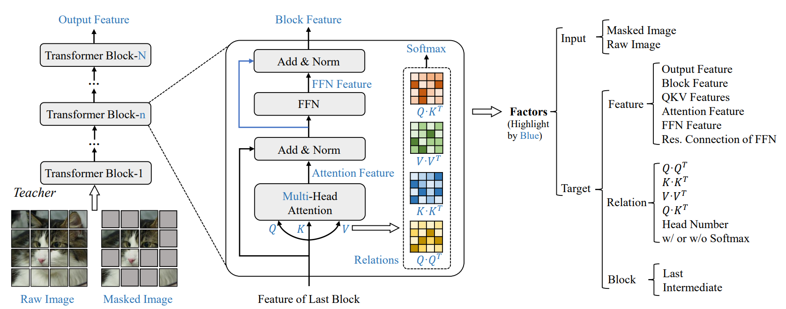

# TinyMIM

## 😎 Introduction
This repository is the official implementation of our 

**TinyMIM: An Empirical Study of Distilling MIM Pre-trained Models** (CVPR2023)

[[arxiv](https://arxiv.org/abs/2301.01296)] [[code](https://github.com/OliverRensu/TinyMIM)]

*[Sucheng Ren](https://oliverrensu.github.io/), [Fangyun Wei](https://scholar.google.com/citations?user=-ncz2s8AAAAJ&hl=en), [Zheng Zhang](https://stupidzz.github.io/), [Han Hu](https://ancientmooner.github.io/)*

> Small models that are critical for real-world applications but cannot or only marginally benefit from MIM pre-training. In this paper, we explore distillation techniques to transfer the success of large MIM-based pre-trained models to smaller ones. We systematically study different options in the distillation framework, including distilling targets, losses, input, network regularization, sequential distillation, etc, revealing that: 1) Distilling token relations is more effective than CLS token- and feature-based distillation; 2) An intermediate layer of the teacher network as target perform better than that using the last layer when the depth of the student mismatches that of the teacher; 3) Weak regularization is preferred.



## News
* Code and checkpoints for Semantic Segmentation are released!
## 🛠 Installation
We build the repo based on [MAE](https://github.com/facebookresearch/mae)

## 🚀 Pretraining
We pretrain TinyMIM on 32 V100 GPU with overall batch size of 4096 which is identical to that in MAE.
```
python -m torch.distributed.launch \
--nnodes 4 --node_rank $noderank \
--nproc_per_node 8 --master_addr $ip --master_port $port \
main_pretrain.py \
    --batch_size 128 \
    --model tinymim_vit_base_patch16 \
    --epochs 300 \
    --warmup_epochs 15 \
    --blr 1.5e-4 --weight_decay 0.05 \
    --teacher_path /path/to/teacher_ckpt \
    --teacher_model mae_vit_large \
    --data_path /path/to/imagenet 
```

## Fine-tuning on ImageNet-1K (Classification)
```
python -m torch.distributed.launch --nproc_per_node=8 main_finetune.py \
    --batch_size 128 \
    --model vit_base_patch16 \
    --finetune ./output_dir/checkpoint-299.pth \
    --epochs 100 \
    --output_dir ./out_finetune/ \
    --blr 5e-4 --layer_decay 0.65 \
    --weight_decay 0.05 --drop_path 0.2 --reprob 0.25 --mixup 0.8 --cutmix 1.0 \
    --dist_eval --data_path /path/to/imagenet
```

## Fune-tuning on ADE20K (Semantic Segmentation)
Please refer [Segmentation/README.md](./Segmentation/README.md)

## Checkpoint
The pretrained and finetuned model on ImageNet-1K are available at 

[[Google Drive](https://drive.google.com/drive/folders/10L305AoXyBSjJK7WfhBlxi3PF2Ni31Yu?usp=sharing)]

## Comparison
Performance comparison on ImageNet-1K classification and ADE20K Semantic Segmentation. 
|Method|Model Size| Top-1 | mIoU|
|---|:---:|:---:|:---:|
|MAE|ViT-T| 71.6 | 37.6|
|TinyMIM|ViT-T| 75.8 | 44.0
|TinyMIM*|ViT-T| 79.6 | 45.0|
|MAE|ViT-S| 80.6 | 42.8|
|TinyMIM|ViT-S| 83.0 | 48.4|
|MAE|ViT-B| 83.6| 48.1|
|TinyMIM|ViT-B| 85.0 | 52.2|

Generalization comparison on out-of-domain dataset (ImageNet-A/R/C)

|Method|Model Size| ImageNet-1K| ImageNet-Adversarial $\uparrow$|ImageNet-Rendition $\uparrow$ |ImageNet-Corruption $\downarrow$ |
|---|:---:|:---:|:---:|:---:|:---:|
|MAE|ViT-T| 71.6 | 7.0|36.5|55.2|
|TinyMIM|ViT-T| 75.8 | 11.0|39.8|50.1|
|MAE|ViT-S| 80.6 | 20.1 |45.6|40.6|
|TinyMIM|ViT-S| 83.0 | 27.5|48.8|35.8|
|MAE|ViT-B| 83.6| 33.6|50.0|37.8|
|TinyMIM|ViT-B| 85.0 | 43.0 |54.6|32.7|

## ✍ Citation

If you have any question, feel free to contact [Sucheng Ren](https://oliverrensu.github.io/) :)
```
@article{ren2023tinymim,
    title={TinyMIM: An Empirical Study of Distilling MIM Pre-trained Models},
    author={Sucheng Ren and Fangyun Wei and Zheng Zhang and Han Hu},
    booktitle = {Proceedings of the IEEE/CVF Conference on Computer Vision and Pattern Recognition (CVPR)},
    month     = {June},
    year      = {2023},
}
```